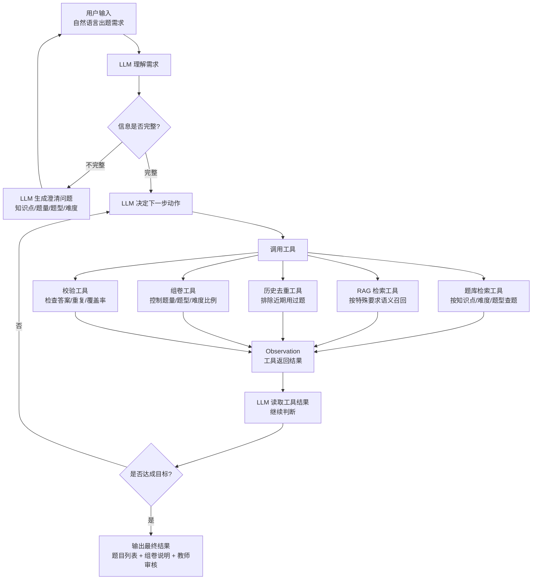

# LLM Tool Loop RAG 出题 Agent 设计

> 文档定位：面向当前 AI 出题模块的简明架构总结，重点说明 LLM、工具和循环控制如何配合完成“自然语言出题 + RAG 检索题库 + 智能组卷”。
> 核心前提：题目主要来自已有题库，LLM 不作为主出题来源，而是负责理解、调度、判断和解释。

---

## 1. 一句话设计

当前 AI 出题 Agent 可以设计为：

> 基于 LLM Tool Loop 的 RAG 出题 Agent。

整体流程是：

```text
用户输入
→ LLM 判断信息是否完整
→ 信息不足则澄清
→ 信息完整则选择工具调用
→ 工具返回题库/RAG/去重/组卷/校验结果
→ LLM 结合用户需求和工具结果判断是否达成目标
→ 未达成则继续循环调用工具
→ 达成后输出题目方案给教师审核
```

---

## 2. LLM / Tools / Loop 架构图



---

## 3. 三个核心角色

### 3.1 LLM：大脑

LLM 负责判断和调度，不负责可靠执行。

主要职责：

- 理解用户自然语言输入。
- 抽取知识点、难度、题型、题量、用途、特殊要求。
- 判断缺少哪些关键信息。
- 生成澄清问题。
- 决定下一步调用哪个工具。
- 读取工具返回结果。
- 判断当前结果是否满足用户目标。
- 最终组织输出，给出题目方案和组卷说明。

### 3.2 Tools：能力

工具负责执行确定性任务，保证结果可靠、可控、可测试。

建议工具包括：

| 工具 | 作用 |
|---|---|
| 题库检索工具 | 根据课程、章节、知识点、题型、难度做结构化查询 |
| RAG 检索工具 | 根据用户特殊要求做语义召回 |
| 掌握度查询工具 | 查询班级或学生薄弱知识点 |
| 历史出题查询工具 | 查询近期用过的题，避免重复 |
| 去重工具 | 检查候选题之间、候选题与历史题之间的相似度 |
| 组卷工具 | 按题量、题型、难度、知识点覆盖生成组卷方案 |
| 校验工具 | 检查答案、选项、知识点覆盖、题型比例和重复度 |

### 3.3 Loop：工作流

Loop 负责让 LLM 和工具反复配合，直到完成目标。

抽象逻辑：

```text
while not done:
    1. 读取用户输入、会话上下文和已有观察结果
    2. LLM 判断信息是否足够
    3. 信息不足时向用户澄清并暂停
    4. 信息足够时选择一个或多个工具
    5. 工具执行并返回 Observation
    6. LLM 判断 Observation 是否满足目标
    7. 满足则输出最终结果
    8. 不满足则继续选择工具
```

---

## 4. 出题场景流程

示例输入：

```text
帮我出一套二叉树小测，中等难度，选择题为主。
```

Agent 处理过程：

```text
1. LLM 抽取信息
   知识点 = 二叉树
   难度 = 中等
   题型 = 选择题为主
   题量 = 缺失

2. LLM 发起澄清
   “需要多少道题？”

3. 用户补充
   “10 道。”

4. LLM 选择工具
   - 调题库检索工具，查询二叉树、中等难度、选择题
   - 调 RAG 检索工具，按“小测、选择题为主”语义召回
   - 调历史去重工具，排除近期用过题
   - 调组卷工具，挑选 10 道并控制知识点分布
   - 调校验工具，检查重复、答案和覆盖率

5. LLM 判断是否完成
   - 题量是否够
   - 题型是否符合
   - 难度是否符合
   - 是否覆盖指定知识点
   - 是否满足特殊要求

6. 达成目标后输出
   返回题目列表、组卷说明和教师审核入口。
```

---

## 5. 目标达成判断

LLM 每轮工具调用后都要做一次 Goal Check。

建议判断项：

- 题目数量是否满足。
- 知识点是否覆盖用户要求。
- 题型比例是否满足。
- 难度是否满足。
- 是否排除了近期重复题。
- 是否满足用户特殊要求。
- 是否有足够信息输出给教师审核。

如果满足，结束循环。

如果不满足，继续循环，例如：

- 候选题不足：扩大检索范围或降低过滤条件。
- 重复题过多：重新检索或替换候选题。
- 难度不匹配：重新筛选指定难度。
- 题型不满足：重新调用题库检索或组卷工具。
- 特殊要求无法满足：向用户说明限制并请求确认。

---

## 6. 设计结论

该方案适合当前项目，因为当前前提是“题目已经给好”，系统更需要的是从题库中精准找题、筛题、组卷，而不是让 LLM 凭空生成题。

因此推荐主路径为：

```text
自然语言需求理解
→ 澄清补全
→ 结构化检索 + RAG 语义召回
→ 候选题去重
→ 智能组卷
→ 质量校验
→ LLM 判断是否达成目标
→ 教师审核发布
```

其中：

- LLM 是大脑，负责理解、调度、判断和解释。
- Tools 是能力，负责检索、去重、组卷和校验。
- Loop 是工作流，负责不断根据工具结果推进任务。
- 教师审核是最后防线，AI 输出不能直接自动发布给学生。
